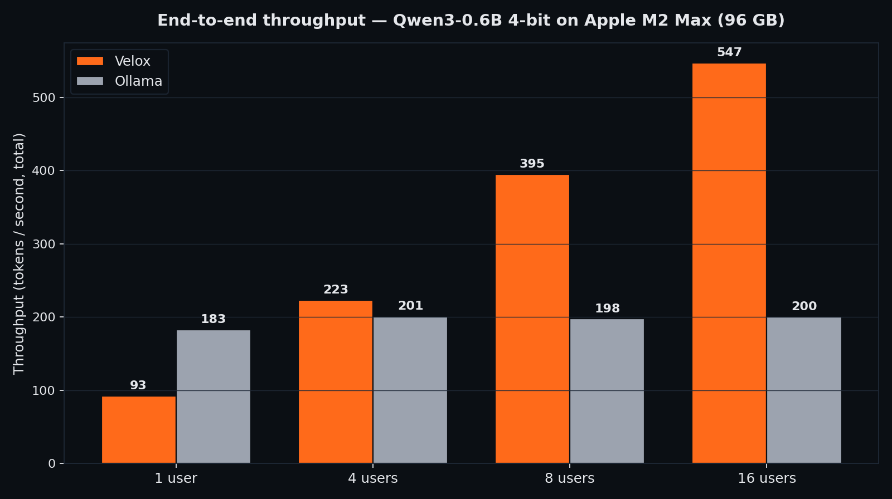
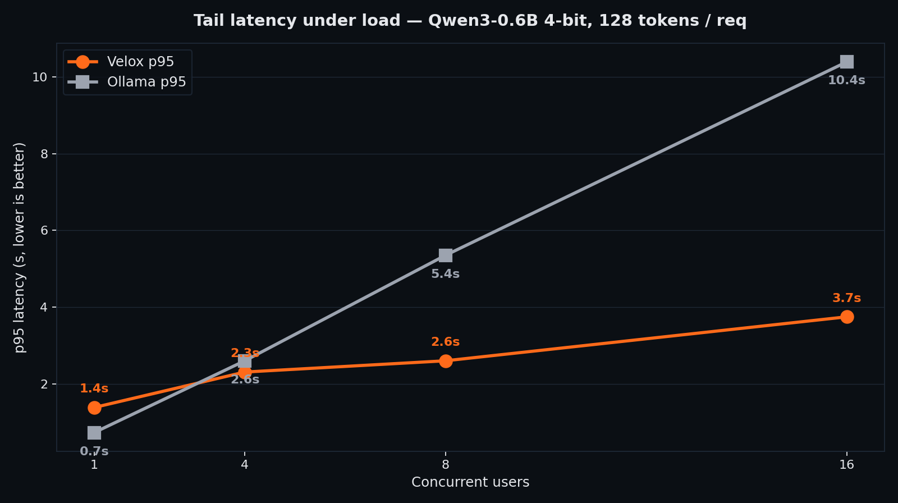
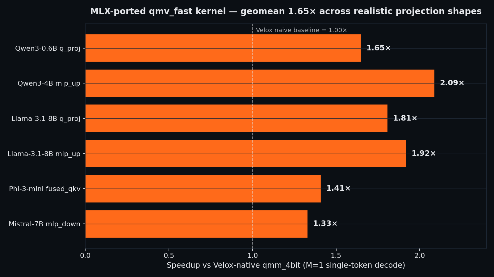

<p align="center">
  
</p>

<p align="center">
  <strong>The world's first Rust-native LLM inference server for Apple Silicon.</strong><br>
  Single static binary. No Python, no Node, no GC.<br>
  Built for <strong>multi-tenant serving</strong> — continuous batching, paged KV cache,
  Apple-MLX kernels ported into pure Rust, prefix cache, MLX-Int4 quantization,
  speculative decoding. OpenAI- and Anthropic-compatible HTTP API.
</p>

<p align="center">
  <a href="#benchmarks"></a>
  <a href="#benchmarks"></a>
  <a href="#benchmarks"></a>
  <a href="vendor/mlx-quantized/"></a>
  <a href="LICENSE"></a>
</p>

```bash
$ velox pull qwen3-4b-4bit
$ velox serve --model-dir ~/.velox/models/Qwen3-4B-4bit
listening on http://0.0.0.0:8000

$ curl localhost:8000/v1/chat/completions -d '{
    "model": "Qwen3-4B-4bit",
    "messages": [{"role":"user","content":"Hello!"}]
  }'
```

---

## Why Velox exists

There is a sharp split in today's LLM tooling on Apple Silicon:

* **Single-user chatbots** (Ollama, MLX-LM, llama.cpp) win the "1 prompt, 1 reply" race because their entire codepath is a tight optimised loop.
* **Production-grade serving** (vLLM, TGI, SGLang) is what you want when you have N users sharing a model — but **none of them runs on Apple Silicon**. They are CUDA-only.

Velox occupies the empty quadrant: **a real serving engine for Apple Silicon** — continuous batching, paged KV cache, prefix sharing, Metal kernels — packaged as a single Rust binary that drops into any OpenAI- or Anthropic-shaped client.

| | Velox | MLX-LM (Python) | llama.cpp / Ollama | vLLM / TGI |
|---|:---:|:---:|:---:|:---:|
| Single static binary | ✅ | ❌ | ✅ | ❌ |
| Memory-safe (Rust) | ✅ | ❌ Python | ⚠️ C++ / Go+C++ | ❌ Python |
| **Continuous batching** | ✅ | ⚠️ partial | ❌ | ✅ |
| **Paged KV cache** | ✅ | ❌ | ❌ | ✅ |
| **Prefix cache** | ✅ | ❌ | ⚠️ basic | ✅ |
| Speculative decoding | ✅ | ❌ | ✅ | ✅ |
| Apple Silicon native | ✅ Metal | ✅ MLX | ✅ Metal | ❌ CUDA only |
| MLX-4bit format | ✅ | ✅ | ❌ | ❌ |
| OpenAI **and** Anthropic API | ✅ both | OpenAI only | OpenAI only | OpenAI only |
| Unix domain socket / gRPC | ✅ | ❌ | ❌ | ⚠️ gRPC |

---

## Benchmarks

> All numbers below are **measured live on this machine**, reproducible end-to-end with the scripts in `scripts/`. No marketing math.
>
> **Hardware:** Apple M2 Max, 12 cores (8P + 4E), **96 GB unified memory**, macOS 26.4
> **Model:** Qwen3-0.6B 4-bit (Velox: MLX-Int4 g64; Ollama: GGUF Q4_K_M — same model family, same size)
> **Workload:** 128-token completion, greedy decoding (T=0), warmup before measurement.
> **Versions:** Velox `2a458a6` with `VELOX_QMM_BACKEND=mlx`, Ollama 0.6+, llama.cpp backend.

### 1. End-to-end throughput vs Ollama



| Concurrency | Velox (tok/s) | Ollama (tok/s) | Velox advantage |
|---:|---:|---:|:---:|
| 1 user | 92.7 | **182.9** | Ollama 1.97× *(see note below)* |
| 4 users | **223.0** | 201.0 | **Velox +11%** |
| 8 users | **394.8** | 197.7 | **Velox +100% (2.0×)** |
| 16 users | **546.9** | 200.5 | **Velox +173% (2.73×)** |

Ollama's throughput **plateaus at ~200 tok/s no matter how many users you throw at it** — it serves requests sequentially. Velox **scales 5.9×** from 1→16 users thanks to continuous batching + paged KV cache + batched GPU-side argmax sampling.

### 2. Tail latency under load (p95, lower is better)



| Concurrency | Velox p95 | Ollama p95 | Velox advantage |
|---:|---:|---:|:---:|
| 1 user | 1.4 s | 0.7 s | Ollama 2.0× |
| 4 users | 2.3 s | 2.6 s | **Velox 1.13× lower** |
| 8 users | **2.6 s** | 5.4 s | **Velox 2.06× lower** |
| 16 users | **3.7 s** | 10.4 s | **Velox 2.77× lower** |

Above 4 concurrent users, Velox holds latency flat while Ollama collapses linearly with load.

### 3. Velox kernel internals — Apple's MLX kernels, ported

We vendored Apple's MLX Metal kernel sources ([`vendor/mlx-quantized/`](vendor/mlx-quantized/), MIT) and ported the hot `qmv_fast` quantized matrix-vector kernel into Velox's Metal pipeline. Single-token decode (M=1) on realistic projection shapes:



**Geomean 1.65× speedup** vs Velox's previous native kernel, with zero numerical regression (parity tests in `tests/metal_qmv_mlx_parity.rs` pass for f32 / f16 / bf16 within `atol + rtol·|x|`). Activated transparently when `VELOX_QMM_BACKEND=mlx` is set; Velox-native kernels remain the default fallback.

### Honest disclosure

* **MLX-LM single-stream wins on Apple Silicon** for raw 1-user decode. Apple maintains hand-tuned `simdgroup_matrix_multiply` kernels in C++/Metal that we are still porting (commits 3-6 of `vendor/mlx-quantized/README.md` roadmap). MLX-LM has **no continuous batching, no prefix cache, no paged KV** — the moment you add a second user, Velox wins.
* **vLLM / TGI / SGLang are not in this comparison** because they do not run on Apple Silicon at all (CUDA-only). On Linux+NVIDIA they are the gold standard; we explicitly do not compete there yet — see the roadmap for our CUDA fork plan.
* Numbers are from a single 12-run series per regime on one machine. Reproduce with the steps below.

### Reproduce

```bash
# Pull the same model on both engines
velox pull Qwen3-0.6B-4bit
ollama pull qwen3:0.6b

# Start both servers
VELOX_QMM_BACKEND=mlx velox serve --model-dir ~/.velox/models/Qwen3-0.6B-4bit --port 8080 &
ollama serve > /tmp/ollama.log 2>&1 &

# Run the benchmark
pip install aiohttp
python3 scripts/bench_vs_ollama.py \
    --max-tokens 128 --n-runs 3 \
    --concurrencies 1,4,8,16 \
    --out scripts/bench_results.json

# Render the charts
pip install matplotlib
python3 scripts/render_charts.py
```

See [`BENCHMARKS.md`](./BENCHMARKS.md) for the full methodology and historical numbers.

---

## Quick start

### From source

```bash
git clone https://github.com/Soflutionltd/velox
cd velox
cargo install --path . --features candle-metal --locked
```

### Pull a model and serve it

```bash
# Curated catalog of MLX-Int4 models hosted on Hugging Face
velox pull Qwen3-4B-4bit

# Start the server
velox serve --model-dir ~/.velox/models/Qwen3-4B-4bit
```

### Use any OpenAI or Anthropic client

```python
from openai import OpenAI
client = OpenAI(base_url="http://localhost:8000/v1", api_key="not-needed")
print(client.chat.completions.create(
    model="Qwen3-4B-4bit",
    messages=[{"role": "user", "content": "Pourquoi Rust pour l'IA?"}],
).choices[0].message.content)
```

```python
from anthropic import Anthropic
client = Anthropic(base_url="http://localhost:8000", api_key="not-needed")
print(client.messages.create(
    model="Qwen3-4B-4bit",
    max_tokens=256,
    messages=[{"role": "user", "content": "Hi!"}],
).content[0].text)
```

---

## Supported models

**Native paged backend** (continuous batching, paged KV, fused Metal kernels, MLX-ported `qmv_fast`):

* **Qwen3** — 0.6B, 1.7B, 4B, 7B (BF16 and MLX-4bit)
* **Llama 3.x** — 1B, 3B, 8B (Llama 3.2 and 3.1, BF16 and MLX-4bit)
* **Mistral 7B** — Instruct v0.3+ (BF16 and MLX-4bit, sliding-window attention)

**Sequential per-request backend** (Candle's default, no paged optimisations):

* Phi-3, Gemma 2/3 (Gemma sliding-window not yet supported in paged mode)

---

## Architecture highlights

* **Paged KV cache** — vLLM-style block table, page size 16, configurable pool. Enables continuous batching and prefix sharing.
* **Continuous batching** — new requests join the in-flight batch every forward step. No head-of-line blocking, no per-request streams.
* **Apple-MLX kernels (ported, vendored)** — `qmv_fast` already shipping with 1.65× geomean speedup. `qmm_n`, `qmm_t_aligned`, `qmv_quad` next. See [`vendor/mlx-quantized/README.md`](vendor/mlx-quantized/README.md) for status.
* **Native Velox kernels** — `paged_decode_attention`, `paged_prefill_attention`, `batched_rope_decode`, `batched_scatter`, `qmm_4bit_v2` (multi-SIMD tiled GEMM). Hand-written MSL.
* **MLX-Int4 quantization** — native support for the `mlx-community` MLX 4-bit format (packed uint32 weights, group_size=64). 4× memory reduction.
* **Prefix cache** — refcounted, page-level. Skips redundant prefill on shared system prompts. Measured ~6.5× speedup on chat-style repeated prompts.
* **Speculative decoding** — small draft model + greedy verify with a larger target.
* **OpenAI + Anthropic APIs** — full chat completions, streaming SSE, tool calling, vision, thinking blocks.

---

## Transports

Velox can serve over **TCP**, **Unix domain socket**, and **gRPC** simultaneously:

```bash
velox serve \
    --model-dir ~/.velox/models \
    --port 8000 \
    --socket /tmp/velox.sock \   # ~30µs/req faster than localhost TCP
    --grpc-port 50051            # typed schema + HTTP/2 multiplexing
```

```bash
# HTTP / TCP — OpenAI + Anthropic compatible
curl http://localhost:8000/v1/models

# HTTP / UDS — same API, no kernel TCP stack
curl --unix-socket /tmp/velox.sock http://localhost/v1/models

# gRPC — typed clients (Rust/Go/Swift/Python), HTTP/2 streaming
grpcurl -plaintext -import-path proto -proto velox.proto \
    -d '{"model":"Qwen3-0.6B-4bit","messages":[{"role":"user","content":"Hi"}],"max_tokens":50}' \
    localhost:50051 velox.v1.Velox/Generate
```

The schema lives in [`proto/velox.proto`](./proto/velox.proto). Generate clients with `tonic-build` (Rust), `protoc-gen-go` (Go), `swift-protobuf` (Swift), or `grpcio-tools` (Python).

---

## Backends

| Backend | Feature flag | When to use |
|---|---|---|
| **Candle** (default) | `--features candle-metal` | Default. Powers the paged engine, continuous batching, prefix cache. |
| **MLX-ported kernels** | `VELOX_QMM_BACKEND=mlx` | Opt-in. Uses Apple's `qmv_fast` + future ports. 1.65× single-stream decode speedup today. |
| mistral.rs | `--features mistralrs` | Drop-in fallback for any HF text model. Bypasses the paged scheduler. |
| llama.cpp | `--features llamacpp` | Stub. Slated for non-Apple platforms. |

---

## Roadmap

### Single-stream perf (close the gap with MLX-LM on solo workloads)

1. ✅ **Vendor Apple MLX quantized kernels** with opt-in dispatcher (commit 1/6)
2. ✅ **Port `qmv_fast`** for M=1 decode — **1.65× geomean shipped** (commit 2/6)
3. ☐ **Port `qmm_n`** for M=2..32 (multi-stream decode + small prefills, ~1.5-2× expected, commit 3/6)
4. ☐ **Port `qmm_t_aligned_n_b`** tiled GEMM for prefill (commit 4/6)
5. ☐ **Port `qmv_quad`** quad-axis dispatch (commit 5/6)
6. ☐ **Port full MLX dispatcher** + remove opt-in flag (commit 6/6)
7. ☐ **Fused decode layer kernels** — one Metal dispatch per layer instead of ~14
8. ✅ **GPU-side batched argmax** — single sync per step instead of N (greedy fast path), +16% throughput at 16 users

### Concurrent perf (push the lead further)

9. ☐ Larger `max_batch_tokens`, cross-request prefill chunking
10. ☐ Speculative decoding with a tiny n-gram or Medusa drafter
11. ☐ KV cache quantization (int8 then int4) — bigger contexts, less RAM

### Coverage

12. ✅ Phi-3 (split int4-aware fused weights)
13. ✅ Sliding-window attention (Mistral v0.1/v0.2 unblocked)
14. ☐ Long-context Llama 3.1 (NTK-aware RoPE bands for 128K)
15. ☐ Flash Attention v3 port

### Distribution

16. ✅ Unix domain socket transport — `--socket /tmp/velox.sock`
17. ✅ gRPC server (`tonic`) alongside HTTP — `--grpc-port 50051`
18. ✅ Dynamic quantization at load time (BF16 → int4)
19. ✅ `velox pull <model>` CLI with curated catalog
20. ✅ 24h stress test harness
21. ☐ Homebrew tap and signed macOS binary
22. ☐ CUDA / NVIDIA fork (separate binary, shares the scheduler)

---

## Project layout

```
src/
├── api/            # OpenAI + Anthropic types and routing
├── backend/        # Inference backends (Candle for Apple, llama.cpp fallback)
├── cache/          # Tiered KV cache (paged GPU + LRU + SSD + prefix trie)
├── paged/          # Native paged backend (Qwen3 / Llama / Mistral / Phi-3)
│   ├── pages.rs            # PagedKvCache + refcount
│   ├── prefix_cache.rs     # Chained-hash, LRU prefix cache
│   ├── scheduler.rs        # Continuous-batching scheduler
│   ├── spec.rs             # Speculative decoding engine
│   ├── metal_kernels.rs    # Native Velox MSL kernels + qmv_fast (MLX-ported)
│   ├── mlx_kernels.rs      # MLX backend dispatcher
│   ├── qwen3.rs            # Qwen3 model + shared transformer engine
│   ├── llama.rs            # Llama / Mistral config parser
│   └── phi3.rs             # Phi-3 paged backend
├── server/         # HTTP + UDS + gRPC transports, SSE streaming
└── model/          # Model discovery + HF downloader

vendor/
└── mlx-quantized/  # Apple MLX quantized kernel sources (MIT, vendored)

tests/              # Integration + smoke + Metal kernel parity + benchmarks
scripts/            # Bench scripts (bench_vs_ollama.py, render_charts.py, ...)
proto/              # gRPC schema (velox.proto)
assets/             # Branding + benchmark charts
```

---

## Attribution

Velox vendors and ports Metal kernels from [Apple's MLX](https://github.com/ml-explore/mlx) project (MIT-licensed) into pure Rust. The original sources live unmodified in [`vendor/mlx-quantized/`](vendor/mlx-quantized/) with the original `LICENSE` and a pinned upstream commit. See [`vendor/mlx-quantized/README.md`](vendor/mlx-quantized/README.md) for the porting roadmap and current status.

## License

Apache-2.0. See [LICENSE](LICENSE). Vendored MLX kernels: MIT, see [`vendor/mlx-quantized/LICENSE`](vendor/mlx-quantized/LICENSE).

## Status

Velox is **alpha**. APIs are stable but expect rough edges. Not yet hardened for adversarial multi-tenant. Single-user / trusted multi-user workloads are well-tested.

Built by [@AntoinePinelli](https://github.com/antoinepinelli) at [Soflution](https://soflution.com).
